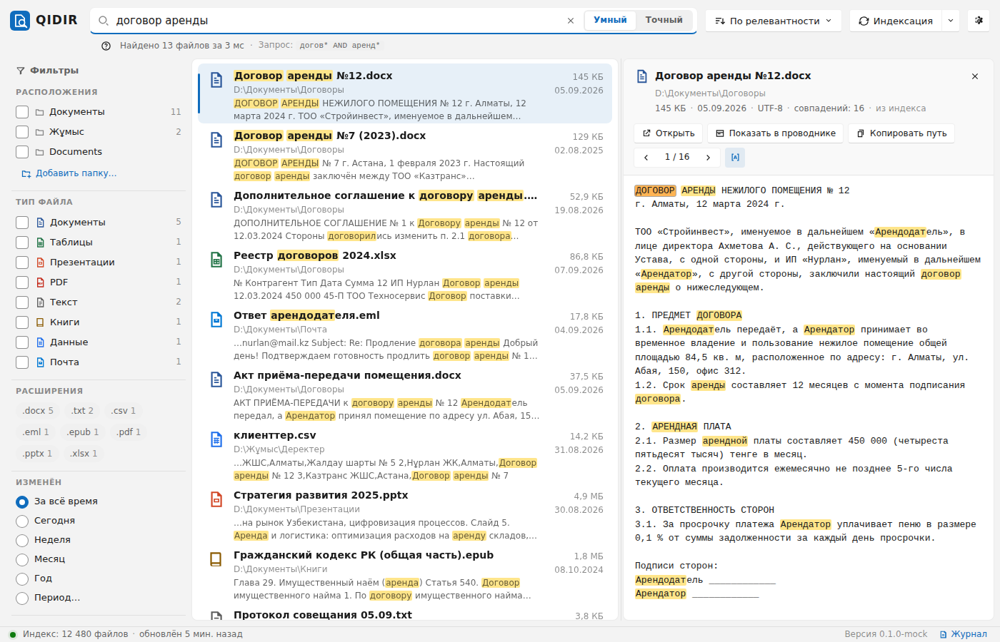
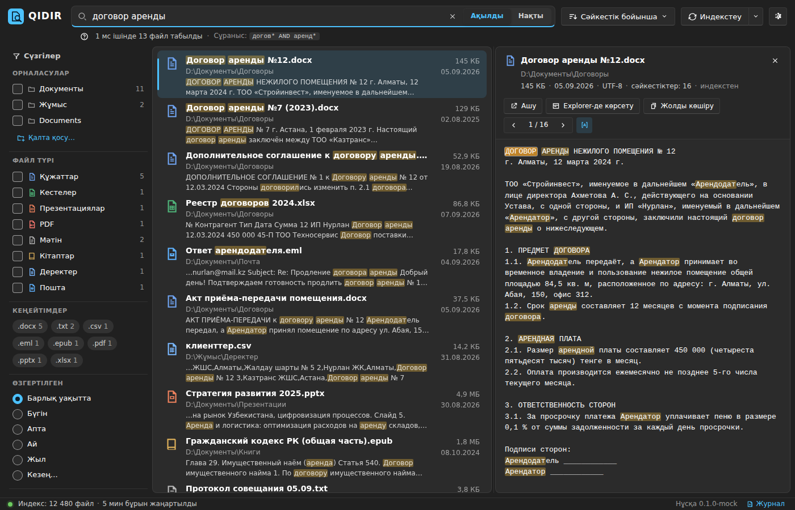
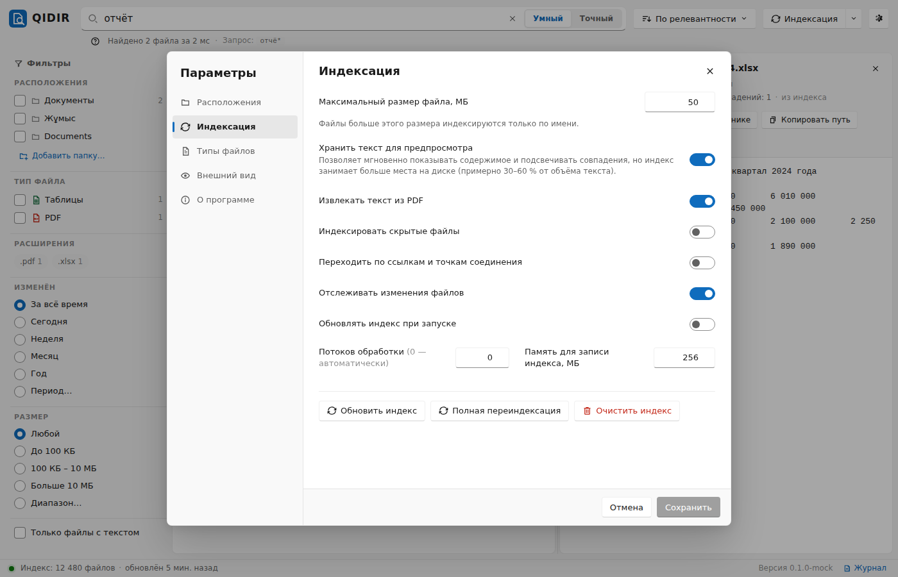
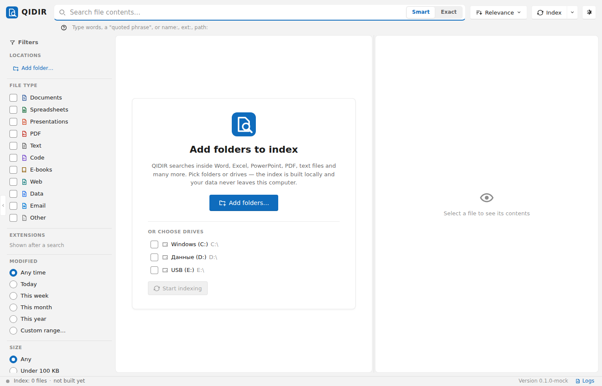
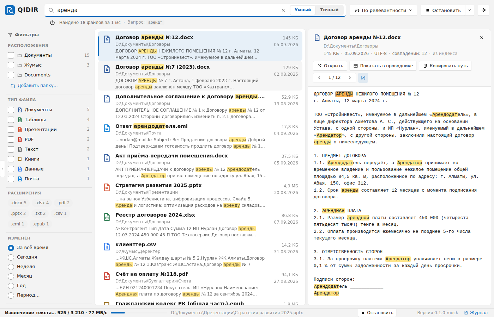

<p align="center">
  
</p>

<h1 align="center">QIDIR</h1>

<p align="center">
  Современный локальный полнотекстовый поиск по файлам для Windows.<br>
  Индексирование, мгновенные результаты, полноценная поддержка русского, казахского и английского языков.
</p>

<p align="center">
  <a href="#возможности">Возможности</a> ·
  <a href="#установка">Установка</a> ·
  <a href="#быстрый-старт">Быстрый старт</a> ·
  <a href="docs/SEARCH_SYNTAX.md">Синтаксис запросов</a> ·
  <a href="docs/ARCHITECTURE.md">Архитектура</a> ·
  <a href="#english">English</a>
</p>

---

**QIDIR** (каз. *қыдыр* — «искать, бродить в поисках») — идейный наследник классических программ поиска по содержимому файлов, таких как «Следопыт», построенный на современном стеке: ядро на Rust с поисковым движком [tantivy](https://github.com/quickwit-oss/tantivy), интерфейс на Tauri 2 + Svelte 5 в стиле Windows 11.

QIDIR отвечает на вопрос *«в каком файле на моём диске написано вот это?»* за миллисекунды, а не за минуты — потому что ищет по заранее построенному индексу, а не перебирает файлы каждый раз.

## Скриншоты

| Светлая тема (русский) | Тёмная тема (казахский) |
|---|---|
|  |  |

| Настройки | Первый запуск | Индексирование |
|---|---|---|
|  |  |  |

## Возможности

### Поиск
- **Полнотекстовый поиск по содержимому** документов Word (DOCX и старые DOC), Excel (XLSX/XLS), PowerPoint, OpenDocument, PDF, RTF, HTML, EPUB, FB2, текстовых файлов, исходного кода и др. — [полный список форматов](docs/ARCHITECTURE.md#поддерживаемые-форматы).
- **Морфология трёх языков.** «Умный» режим находит все словоформы: запрос `договор аренды` найдёт «договоры аренды», «договора об аренде»; `кітап` — «кітаптар», «кітаптарымызда»; `search` — «searching», «searched». Для русского и английского используются стеммеры Snowball, для казахского — собственный стеммер суффиксов агглютинативного языка.
- **Устойчивость к раскладке.** Казахские буквы `ә ғ қ ң ө ұ ү һ і` сворачиваются к ближайшим русским: запрос `Казакстан`, набранный на русской раскладке, находит «Қазақстан»; `ё`/`е` не различаются.
- **Точный режим** для поиска точных словоформ, кодов, номеров.
- **Язык запросов:** фразы `"…"`, `OR`, исключения `-слово`, префиксы `догов*`, маски `д?говор`, нечёткий поиск с опечатками `договр~`, поля `name:`, `ext:`, `path:`, `content:`. Операторы понимают русский и казахский (`ИЛИ`, `НЕ`, `НЕМЕСЕ`, `ЕМЕС`).
- **Фильтры и фасеты:** по папкам, типу файла, расширению, дате изменения, размеру — со счётчиками, обновляющимися по результатам.
- **Сниппеты и предпросмотр** с подсветкой найденных слов (включая словоформы), навигация по совпадениям, открытие файла, показ в Проводнике, «Открыть с помощью…», копирование пути.

### Индексирование
- **Инкрементальное:** повторный запуск обрабатывает только новые и изменённые файлы, удалённые файлы исчезают из индекса.
- **Параллельное извлечение текста** на всех ядрах, отмена в любой момент без потери проделанной работы.
- **Наблюдение за папками:** изменения на диске попадают в индекс автоматически.
- **Старые кодировки:** Windows-1251, KOI8-R, CP866, UTF-16 без BOM определяются автоматически — архивы 90-х и 2000-х ищутся так же, как современные документы.
- **Исключения** (`node_modules`, `.git`, системные папки Windows и т. д.), ограничение размера файла, выбор расширений, индексирование скрытых файлов.
- Индекс хранится в `%LOCALAPPDATA%\QIDIR`, ничего не отправляется в сеть.

### Интерфейс
- Стиль Windows 11: светлая и тёмная темы (или по системной), плавная виртуализированная выдача на тысячи результатов, изменяемая панель предпросмотра, полная клавиатурная навигация.
- Интерфейс на русском, казахском и английском.
- Устанавливается для текущего пользователя (NSIS) или через MSI; не требует прав администратора.

## Установка и запуск на другом компьютере с Windows

Требования: **Windows 10 (версия 1809 и новее) или Windows 11, 64-bit**. Ничего устанавливать дополнительно не нужно (ни .NET, ни Java, ни Visual C++ Redistributable) — EXE самодостаточный. Единственная системная зависимость — среда выполнения **Microsoft Edge WebView2**: в Windows 11 она есть всегда, в Windows 10 обычно установлена вместе с Edge; установщик QIDIR докачивает её автоматически, портативной версии может понадобиться [Evergreen Bootstrapper](https://developer.microsoft.com/microsoft-edge/webview2/#download) (~2 МБ).

### Вариант 1 — портативная версия (без установки)

Готовые файлы лежат в папке [`release/`](release/) этого репозитория:

| Файл | Что это |
|------|---------|
| `release/QIDIR-portable/QIDIR.exe` | приложение с графическим интерфейсом |
| `release/QIDIR-portable/qidir.exe` | консольная утилита (тот же движок) |
| `release/QIDIR-portable/WebView2Loader.dll` | загрузчик WebView2, должен лежать рядом с `QIDIR.exe` |
| `release/QIDIR-1.0.0-windows-x64-portable.zip` | всё вышеперечисленное одним архивом |
| `release/SHA256SUMS.txt` | контрольные суммы |

Пошагово:

1. Скопируйте на целевой компьютер `QIDIR-1.0.0-windows-x64-portable.zip` (или всю папку `QIDIR-portable`). Скачать одним файлом можно так: откройте архив на GitHub и нажмите **Download raw file** (кнопка со стрелкой), либо `git clone` репозитория.
2. Распакуйте архив в любую папку, например `C:\QIDIR`. Внутри должны быть `QIDIR.exe`, `qidir.exe`, `WebView2Loader.dll`, `README.txt`.
3. Дважды щёлкните `QIDIR.exe`. Права администратора не требуются.
4. При первом запуске Windows SmartScreen может показать «Система Windows защитила ваш компьютер», потому что файл не подписан сертификатом. Нажмите **Подробнее → Выполнить в любом случае**.
5. Если появится сообщение об отсутствии WebView2 (бывает только на Windows 10 без Edge), установите [WebView2 Runtime](https://developer.microsoft.com/microsoft-edge/webview2/#download) и запустите `QIDIR.exe` снова.
6. В открывшемся окне нажмите **Добавить папку…**, выберите папки или диски и дождитесь индексирования (прогресс в строке состояния; искать можно сразу).

Проверка целостности (PowerShell):

```powershell
Get-FileHash .\QIDIR-portable\QIDIR.exe -Algorithm SHA256
# сравните с release\SHA256SUMS.txt
```

Консольная утилита из той же папки:

```powershell
.\qidir.exe add-root D:\Документы
.\qidir.exe index
.\qidir.exe search "договор аренды"
```

Индекс и настройки хранятся в `%LOCALAPPDATA%\QIDIR`. Чтобы удалить программу, удалите папку с `QIDIR.exe` и, при желании, `%LOCALAPPDATA%\QIDIR`.

### Вариант 2 — установщик

`QIDIR_1.0.0_x64-setup.exe` (NSIS, установка для текущего пользователя, ярлыки в меню «Пуск», автоматическая установка WebView2) и `QIDIR_1.0.0_x64_ru-RU.msi` (для развёртывания в организации) собираются в GitHub Actions на Windows: откройте вкладку **Actions → CI → последний успешный запуск → Artifacts** и скачайте `QIDIR-windows-installers` или `QIDIR-windows-portable`. Для тегов `v*` те же файлы публикуются в разделе **Releases**.

### Как собраны файлы в `release/`

Бинарники в `release/` кросс-скомпилированы из этого коммита под `x86_64-pc-windows-gnu` (mingw-w64, статическая линковка CRT: `.cargo/config.toml`) и проверены запуском под Wine (консольная утилита — индексирование, поиск на трёх языках, предпросмотр; графическое приложение — старт, инициализация движка). Артефакты CI собираются на `windows-latest` компилятором MSVC — это «официальная» сборка, если есть выбор, используйте её. Пересобрать папку `release/` самостоятельно: `scripts/package-release.sh`.

## Быстрый старт

1. Запустите QIDIR и добавьте папки или диски для индексирования (кнопка **Добавить папку…**).
2. Дождитесь окончания индексирования — прогресс виден в строке состояния; искать можно уже во время индексирования.
3. Введите запрос. Результаты появляются по мере ввода. Переключатель **Умный / Точный** меняет режим морфологии.
4. Выберите результат — справа откроется текст файла с подсветкой. `Enter` открывает файл, `Ctrl+Enter` показывает его в Проводнике, `Ctrl+C` копирует путь, `F3` — следующее совпадение.

Подробно о языке запросов — в [docs/SEARCH_SYNTAX.md](docs/SEARCH_SYNTAX.md).

### Горячие клавиши

| Клавиши | Действие |
|---|---|
| `Ctrl+F`, `Ctrl+K` | Фокус в строку поиска |
| `Enter` / `Ctrl+Enter` | Открыть файл / показать в Проводнике |
| `Ctrl+C` | Скопировать путь к файлу |
| `F3` / `Shift+F3` | Следующее / предыдущее совпадение в предпросмотре |
| `F5` | Обновить индекс |
| `Ctrl+,` | Настройки |
| `Ctrl+B` / `Ctrl+P` | Свернуть боковую панель / предпросмотр |

## Командная строка

Вместе с приложением поставляется утилита `qidir` — тот же движок без интерфейса:

```text
qidir add-root D:\Документы
qidir index                       # инкрементально
qidir index --full --watch        # полная переиндексация и слежение за изменениями
qidir search "договор аренды" --ext docx,pdf
qidir search -e "точная фраза" --json
qidir preview D:\Документы\договор.docx аренда
qidir extract old-report.doc      # что именно видит индексатор в файле
qidir analyze "Кітаптарымызда Қазақстан тарихы"   # токены и стемы
qidir stats
```

Данные по умолчанию — в `%LOCALAPPDATA%\QIDIR`; другое место задаётся `--data-dir` или переменной `QIDIR_DATA_DIR`. Приложение и утилита не должны работать с одним индексом одновременно.

## Сборка из исходников

Требуются Rust (stable, ≥ 1.80), Node.js ≥ 20 и для Windows — Visual Studio Build Tools (C++). Подробности и сборка под другие ОС — в [docs/BUILD.md](docs/BUILD.md).

```powershell
git clone https://github.com/aslan4ik92/qadam.git
cd qadam
cargo test --workspace --exclude qidir-desktop     # тесты ядра и CLI
cd apps/desktop
npm ci
npm run tauri dev                                  # запуск в режиме разработки
npm run tauri build                                # установщики в target/release/bundle
```

## Структура репозитория

```text
crates/qidir-core     ядро: анализ текста RU/KZ/EN, экстракторы форматов, индекс tantivy, поиск
crates/qidir-cli      консольная утилита qidir
apps/desktop          приложение Tauri 2: src (Svelte 5 + TypeScript), src-tauri (Rust-бэкенд)
docs                  архитектура, синтаксис запросов, сборка
.github/workflows     CI (тесты, сборка установщиков) и публикация релизов
```

## Лицензия

[MIT](LICENSE).

---

## English

**QIDIR** is a modern local full-text file search application for Windows — a spiritual successor of classic tools like Sledopyt — with a Rust core (tantivy), a Tauri 2 + Svelte 5 interface in the Windows 11 style and first-class support for **Russian, Kazakh and English**.

- Searches *inside* DOCX/DOC, XLSX/XLS, PPTX, ODT/ODS/ODP, PDF, RTF, HTML, EPUB, FB2, plain text, source code and more.
- Morphology-aware "smart" mode for all three languages (Snowball for RU/EN, a custom suffix stemmer for Kazakh), plus an exact mode.
- Keyboard-layout tolerant: Kazakh letters fold to their Russian neighbours, `ё` = `е`.
- Query language: phrases, `OR`, `-exclusions`, prefixes, wildcards, fuzzy terms, `name:` `ext:` `path:` `content:` fields.
- Incremental, parallel, cancellable indexing with a filesystem watcher; legacy encodings (cp1251, KOI8-R, CP866, BOM-less UTF-16) detected automatically.
- Facets and filters, highlighted snippets and previews, open / reveal in Explorer / open with / copy path.
- Everything stays on your machine.

**Run it on Windows:** unzip `release/QIDIR-1.0.0-windows-x64-portable.zip` anywhere and start `QIDIR.exe` (Windows 10 1809+/11 x64, WebView2 runtime; no install, no admin rights). Installers (NSIS/MSI) are produced by CI on Windows — see Actions artifacts or Releases.

See [docs/ARCHITECTURE.md](docs/ARCHITECTURE.md), [docs/SEARCH_SYNTAX.md](docs/SEARCH_SYNTAX.md) and [docs/BUILD.md](docs/BUILD.md).
